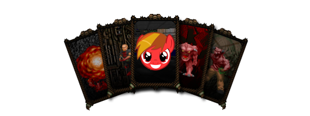
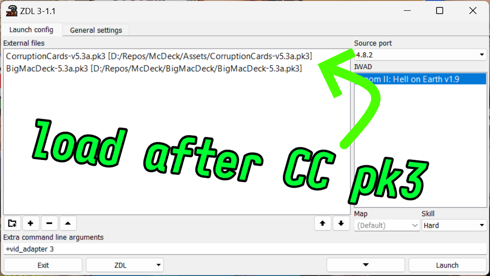
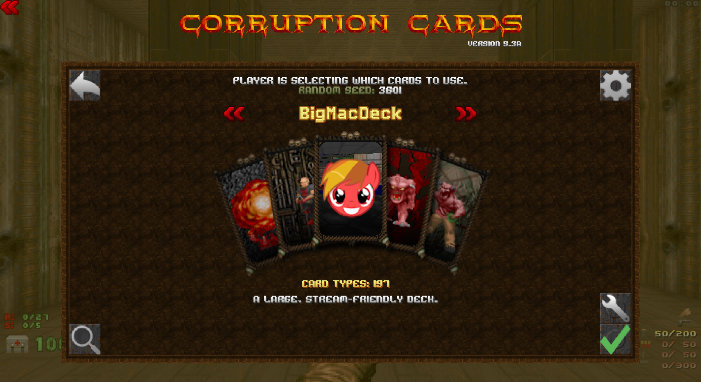
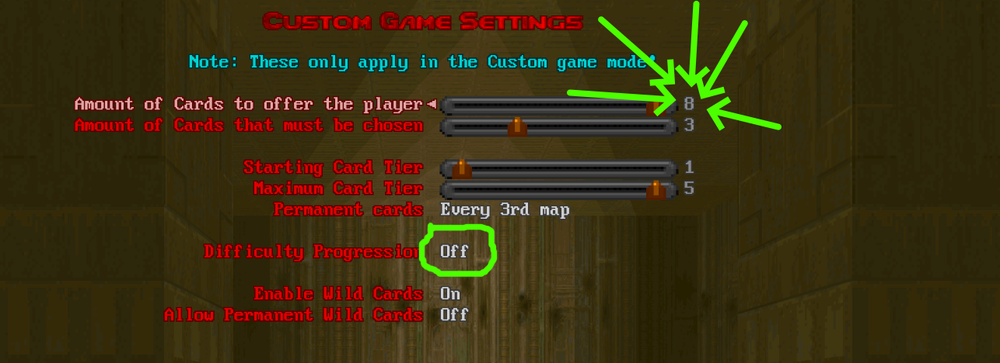
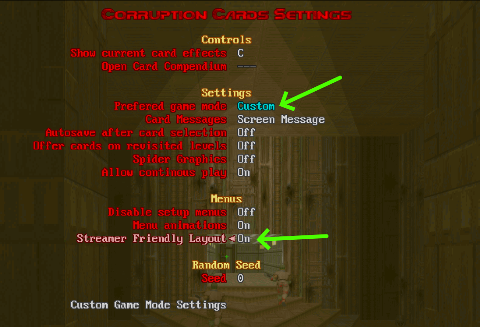
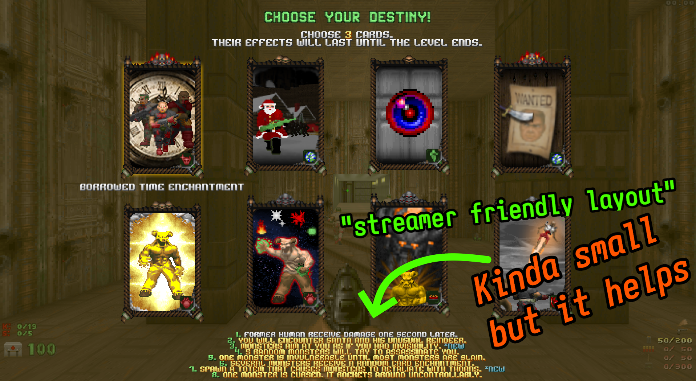

# BIGMACDECK

A large, streaming-friendly deck for [Corruption Cards](https://forum.zdoom.org/viewtopic.php?t=67939) with:
- 197 active cards
- 50 disabled cards
- 8 "bookmarked" cards

Avoiding:
  - Potentially map-breaking cards
  - Special "achievement" style or other cards that can by themselves make gameplay grindy or annoying.
  - Progress-inhibiting or reversing cards.

Just load the [`BigMacDeck-*.pk3`](BigMacDeck-5.4.pk3) (right click to "Save As") after the Corruption Cards PK3 and the deck will be presented along with the defaults:

Voila:

Difficulty progression is disabled by default, but custom mode settings can override this.  Disabling it ensures maximum variety in card selection.  IMO, variety is what makes Corruption Cards great.  For this same reason i use custom mode to offer eight cards:

Eight could be a bit much for streaming, maybe six would be more reasonable using "streamer friendly layout":

Which looks like this:

---

Creating a custom deck is simple but tedious given the sheer number of cards.  It boils down to creating a `CCARDS.txt` as described [here](https://github.com/CutmanMike/corruptioncards) and plopping that into a `.pk3`.  The folder `BigMacDeck-5.4` mirrors `BigMacDeck-5.4.pk3` - just two files, the `CCARDS.txt` and the BigMacDeck graphic.  In time this repository will house "McDeck", a tool i'm working on to simplify creation and sharing of custom decks.

---

Some cards i've disabled may seem borderline or "not too bad" but keep in mind that due to eggs, random enchantments, deck modifying cards and so on - any card in the deck could pop up at any time.  Possibly annoying card in a possibly annoying scenario is no bueno.

BOOKMARKED CARDS:
Not included in the deck, but candidates to add back in.
--------------------------------------------------------

Scent Of Blood:
------
After taking 100+ damage, extra monsters will spawn.
Notes: Progress-blocking.

Boiling Blood:
------
Players bleed damaging pools of blood.
Notes: Generally annoying.

Wrath Sentries:
------
Add several sentries that fire {species} projectiles.
Notes: Progress-blocking.

Cult Chow:
------
Health items become Priest Porridge (tastes better warm!)
Notes: I've had some weird issues with stacked health potion.

Brutal Totem:
------
Spawn a totem that doubles monster damage.
Notes: A wee bit unfair ?

Frankenstein's Gift:
------
{species} can stitch together two corpses to make a new monster.
Notes: Gets out of control when applied randomly mid-level.

Armageddon:
------
After 1000 kills, all monsters are given the Nuclear Curse.
Notes: Does this cause a chain reaction ?

Mega Deathmatch:
------
An 8-bit warrior will challenge you.
Notes: What's the HP ?

DISABLED CARDS:
---------------

Leaking Soul:
Your bonus health drains over time.
------

Annoying Devil:
A devil will follow players and cause mischief.
------

Unfinished Business:
------
Monsters you left alive in previous levels will return.
Notes: I've had this erroneously add dozens of monsters in.

Marked for death:
------
Monsters begin hunting players from the start.
Notes: Potentially level-breaking.

Sludge Rain:
------
Sludge rain will fall outside, slowing your movement.
Notes: Super bad combo if a level has challenging hurtfloor areas.

Poultry Hazard:
------
Chickens will appear. Avoid killing them at all costs.
Notes: Amusing as a temporary card, but a nuisance as a permanent card.

Shadows Manifest:
------
A damaging shadow will spawn and trail behind players.

Blade Traps:
------
Spawn several spinning blade traps in the level.
Notes: Much more damaging than other traps and can break invisible-lift style bridges and similar tricks.

Teleport Shock:
------
When something teleports, a shockwave shoves entities away.
Notes: Potentially level breaking.

Co-operative Evil:
------
Monsters no longer infight.
Notes: 🤔

Breach!:
------
Monsters gain a speed boost when they open doors.
Notes: Potentially level breaking.  I've seen doors opening that shouldn't be, plus they stay open.

Hotter Start:
------
At the start of the level, 20 monsters are teleported near players.

Adaptable Foe:
------
Bosses gain up to 3 random enchantments while in combat.

The Howling:
------
Monsters may transform into a Werewolf when damaged.
Notes: Annoying as hecc, there i said it.

Chain Resurrections:
------
When a monster resurrects, another nearby is also resurrected.

Night Totem:
------
Spawn a totem that makes monsters invisible.
Notes: Completely invisible = completely unreasonable.

Vile Totem:
------
Spawn a totem that resurrects nearby monsters.

Concealed Totems:
------
Totems are invisible until dropped.
Notes: Completely invisible = completely unreasonable.

Lethality Curse:
------
One monster is cursed. Killing it drastically lowers your health.

Resurrection Curse:
------
One monster is cursed. Killing it resurrects nearby monsters.
Notes: Much worse than similar duplication effects.

Mirror Curse:
------
One monster is cursed. Killing it mirrors your world.
Notes: I've heard of weird effects while streaming plus it's kinda meh.

Invisibility Curse:
------
One monster is cursed. It is completely invisible.
Notes: Completely invisible = completely unreasonable.

Miasma Curse:
------
One monster is cursed. Killing it makes nearby floors toxic.
Notes: Progress blocking.

Vegetation Curse:
------
One monster is secretly cursed. Killing it spawns vegetation.
Notes: Visibility is handy

Curse Of Decay:
------
One monster is cursed. When it dies, exploding critters infest 
nearby corpses.
Notes: SUPER annoying.

Incineration Curse:
------
One monster is cursed. Killing it burns nearby items.
Notes: Potentially level breaking.

Curse of Achilles:
------
One monster is cursed. It can only be damaged at very close range.
Notes: Imagine choosing between sniping a cybie or teleporting next to it.

Kleptomania:
------
{species} will steal items off the ground.
Notes: Good luck getting 100% items with this one.

Casali's Watchers:
------
{species} may become an immobile, self-resurrecting sentry.
Notes: Progress blockers

Forbidden Gaze:
------
Looking at {species} for too long burns the player.
Notes: Annoying

Living Vessel:
------
{species} spawns 3 {species} when killed.
Notes: Can be applied randomly... Progress killer.

Noxious Vials:
------
{species} gain the ability to throw poison gas vials.
Notes: Super annoying.

Barbarity:
------
{species} always deal the highest damage they've ever dealt.
Notes: Can be applied randomly...

Reflect Enchantment:
------
{species} reflect projectiles back at you.
Notes: No

Acid Blood Enchantment:
------
{species} bleeds lethal acid.
Notes: Super annoying.

Leap Enchantment:
------
{species} can leap at their prey.
Notes: No 100% kills if they jump OOB.

High Voltage Enchantment:
------
{species} will electrocute nearby players.
Notes: Super annoying

Infestation Enchantment:
------
Exploding critters may hide inside {species} corpses.
Notes: Super annoying

Bombardment Augment:
------
{species} continuously throw projectiles.
Notes: Progress-blocking.

Electric Augment:
------
{species} projectiles electrocute nearby players.
Notes: Super annoying.

New Hunting Grounds:
------
Remove most monsters, but replace some with Archviles.
Notes: Not too fun eh ?

Curse of Dormin:
------
One monster is cursed. Killing it transforms you into the monster.

Oath to the Old God:
------
5 monsters become disciples. If they all die, the Ancient One is summoned.

Demand / Supply:
------
Items are removed. Stand still and hold USE to spawn them all.

Endless Flow:
------
A green liquid will slowly fill the level, resurrecting monsters.

Angry Bones:
------
Remove all monsters in this level, but an angry Revenant stalks you.

Grace of Lilith:
------
|index entry637:changes manynfDDDDDDDDDDDDDDDDDDDDDDDDDDDDDDDDDDDDDDD NON-ZDOOM DETECTED, PLEASE START IN REGULAR ZDOOM NON-ZDOOM DETECTED, PLEASE START IN REGULAR ZDOOM NON-ZDOOM DETECTED, PLEASE START IN REGULAR ZDOOM - whoami

Swimming Lessons:
------
One Key is trapped, and will spawn 3 bosses.

Break the Bat:
------
Bane will challenge you to a 1 on 1 fight.

Second Slice:
------
You must do a second lap of the level under a time limit.
